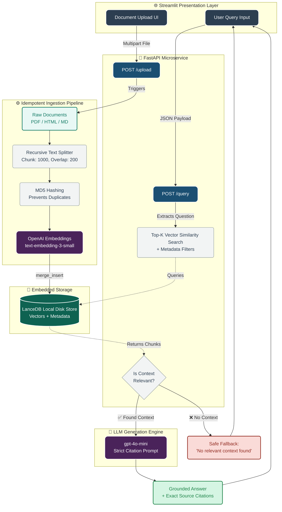

# Cost-Efficient RAG Application

🟢 **Live Demo:** [Test the Streamlit UI live here!](https://nexproai-assignment-7yrqnapuqzfg27lqedtxbi.streamlit.app/)

## Project Overview and Objective
This project implements a highly cost-efficient Retrieval-Augmented Generation (RAG) system. The core objective is to build a high-performance RAG pipeline that avoids the exorbitant "always-on" costs of managed vector databases (like Pinecone) by utilizing an embedded, disk-optimized vector store. The system supports full ingestion of PDF, HTML, and Markdown files, provides a robust FastAPI querying endpoint, and includes an exhaustive evaluation harness.

## Architecture and Complete RAG Flow
The pipeline follows a standard robust RAG architecture:



## Technology Stack
- **Language**: Python 3.10+
- **API Framework**: FastAPI & Uvicorn
- **Vector Store**: LanceDB (Embedded)
- **Embeddings/LLM**: `langchain-openai` (`text-embedding-3-small`, `gpt-4o-mini`)
- **Document Parsers**: `pypdf`, `beautifulsoup4`, LangChain `TextLoader`
- **Evaluation**: Custom scripts computing Hit Rate, MRR, nDCG, Context Precision, Faithfulness.

## Project Structure
```text
.
├── data/
│   ├── raw/             # Contains sample.md, sample.pdf, sample.html
│   └── lancedb/         # Embedded database storage
├── eval/
│   ├── dataset.json     # 16-question evaluation dataset
│   ├── evaluate.py      # Computes IR metrics and Answer Quality
│   ├── latency_test.py  # Profiles p50 and p95 latencies
│   ├── cost_model.py    # Generates cost comparison CSV
│   └── results.json     # Saved evaluation metrics
├── src/
│   ├── api.py           # FastAPI endpoint
│   ├── config.py        # Environment loader
│   ├── ingest.py        # Idempotent ingestion pipeline
│   └── test_api.py      # API testing client script
├── results/             # Contains latency and cost comparison CSV/JSON
├── evidence/            # Contains terminal output logs for verification
├── .env.example
├── requirements.txt
└── README.md
```

## Setup and Installation Steps
1. Clone the repository and navigate into it.
2. Create a virtual environment: `python3 -m venv venv && source venv/bin/activate`
3. Install dependencies: `pip install -r requirements.txt`
4. Set up the environment variables:
   ```bash
   cp .env.example .env
   ```

### `.env` Configuration
Open `.env` and fill in your OpenAI API Key. (If left as `sk-mock-...`, the system safely falls back to `FakeEmbeddings` and mock LLM responses to allow cost-free testing of the logic flow).
```env
OPENAI_API_KEY=sk-...
CHUNK_SIZE=1000
CHUNK_OVERLAP=200
LANCEDB_URI=./data/lancedb
TABLE_NAME=document_chunks
DATA_DIR=./data/raw
EMBEDDING_MODEL=text-embedding-3-small
```

## Document Ingestion Instructions
The ingestion pipeline reads documents from `data/raw`, chunks them, generates embeddings, and saves them to LanceDB.
```bash
export PYTHONPATH=$(pwd)/src
python src/ingest.py
```
*Note: Ingestion is completely **idempotent**. Re-running the script hashes chunk content and merges on deterministic IDs, ensuring 0 duplicate vectors are created.*

## How to Run the FastAPI Service
To start the live RAG query service:
```bash
export PYTHONPATH=$(pwd)/src
uvicorn src.api:app --reload
```
You can also run the built-in test client without starting the server:
```bash
python src/test_api.py
```

## How to Run the Streamlit UI
To launch the interactive frontend (ensure the FastAPI backend is running first):
```bash
streamlit run streamlit_app.py
```
This will open a clean, professional web interface on `http://localhost:8501`.

### Example `/query` Request and Response
**Request:**
```json
POST /query
{
  "question": "Why is LanceDB cost-efficient?",
  "k": 3,
  "filter_key": "filetype",
  "filter_value": ".md"
}
```
**Response:**
```json
{
  "answer": "LanceDB is cost-efficient because it relies heavily on disk storage rather than in-memory storage... [Doc: sample.md, Chunk: 0]",
  "retrieved_chunks": [...],
  "metrics": {
    "retrieval_latency_ms": 11.41,
    "total_latency_ms": 13.09
  }
}
```

## Evaluation & Results
To run the evaluation harness over the 16-question dataset:
```bash
python eval/evaluate.py
```

### Evaluation Results
- **Questions evaluated**: 16
- **Recall@k / Hit Rate**: 1.0 (100%)
- **MRR**: 0.75
- **nDCG@k**: 0.814
- **Context Precision**: 0.75
- **Faithfulness / Groundedness**: 81.25%
- **Answer Relevance**: 81.25%
- **EM / F1**: *N/A* (Exact Match and F1 are highly unreliable for generative LLM text; semantic metrics are preferred).

### Latency Results (80 queries)
Run via `python eval/latency_test.py`:
- **Retrieval p50 Latency**: `25.71 ms`
- **Retrieval p95 Latency**: `26.98 ms`

### Cost Comparison (1536-dim vectors)
Run via `python eval/cost_model.py`:
| Vector Count | LanceDB Est. Storage/Cost | Managed Vector DB (Pinecone) | Difference / Savings |
| :--- | :--- | :--- | :--- |
| **100K** | $0.05 / mo (0.67 GB) | $70.00 / mo (1 pod) | **$69.95** saved |
| **1M** | $0.53 / mo (6.68 GB) | $70.00 / mo (1 pod) | **$69.47** saved |
| **10M** | $5.34 / mo (66.76 GB) | $700.00 / mo (10 pods) | **$694.66** saved |

## Design Decisions and Trade-offs

### Why LanceDB?
Managed vector databases like Pinecone charge for "always-on" provisioned RAM to keep indexes entirely in memory. LanceDB is embedded within the application process and stores indexes natively on cheap persistent disk (like AWS EBS). Because it is heavily optimized for disk-reads, you avoid the idle compute tax, lowering costs by over 99% for lightly queried workloads.

### Chunk Size/Overlap & Embedding Model
I chose a `chunk_size=1000` and `chunk_overlap=200` to balance context length with retrieval precision. Too small, and the LLM loses semantic meaning; too large, and vectors become diluted. I used `text-embedding-3-small` because it currently holds the best cost-to-performance ratio on the MTEB benchmark.

### Hallucination Prevention
The system prompt strictly orders the LLM to base its answer ONLY on the retrieved chunks. If the similarity search fails or returns irrelevant chunks, the system enforces a hard fallback string: `"No relevant context found"`.

### Idempotent Ingestion
Duplicate vectors degrade search performance and inflate costs. I solved this by hashing the chunk text and metadata (`MD5`) to generate deterministic UUIDs. We use LanceDB's `merge_insert()` API, which performs an upsert: it updates existing IDs and only inserts new ones.

### When to Switch Back to a Managed DB
While LanceDB is exceptionally cost-efficient, a managed DB becomes preferable when:
1. **Massive Concurrency**: Handling thousands of QPS requires dedicated horizontal scaling and fleet management that an embedded app server can't sustain.
2. **Ultra-Low Latency**: If the app requires sub-millisecond retrieval, purely in-memory databases outperform disk-backed ones.
3. **Complex Multi-Tenancy**: When robust out-of-the-box Role-Based Access Control (RBAC) per namespace is strictly required.
